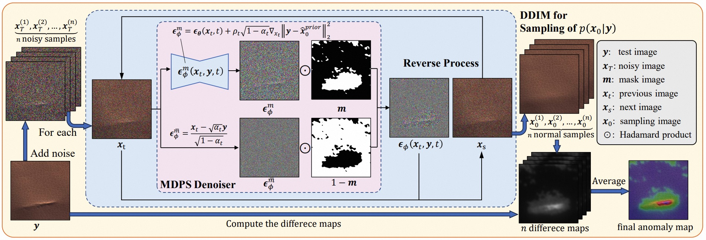

# Unsupervised Anomaly Detection via Masked Diffusion Posterior Sampling (MDPS)
Implementation of MDPS. 

</img>

## Prepare
1. Creating a virtual environment
```bash
conda create --name MDPS python=3.10
```

2. Install packages
```bash
conda activate MDPS
pip install -r requirements.txt
```
3. Download datasets
We evaluate MDPS on the datasets MVTec and BTAD.
You should download the dataset to the path ./datasets

4. You can use our checkpoints, download it to the path ./checkpoints:
[MDPS_Model_Path](https://pan.baidu.com/s/1qGIyBpUM4N0EpdtNiUQ24A?pwd=buom)


## Train
To train a Unet, you can simply run the train.sh. (Modify the category in the ./config/train.yaml)
```bash
sh train.sh
```

## Test
To test our checkpoints, you can simply run the eval.sh
```bash
sh eval.sh
```

## Citations
🌟 If you find our work helpful, please leave us a star and cite our paper.
```
@article{wu2024unsupervised,
  title     = {Unsupervised Anomaly Detection via Masked Diffusion Posterior Sampling},
  author    = {Wu, Di and Fan, Shicai and Zhou, Xue and Yu, Li and Deng, Yuzhong and Zou, Jianxiao and Lin, Baihong},
  booktitle = {Proceedings of International Joint Conference on Artificial Intelligence (IJCAI)},
  pages     = {2442--2450},
  year      = {2024},
}

